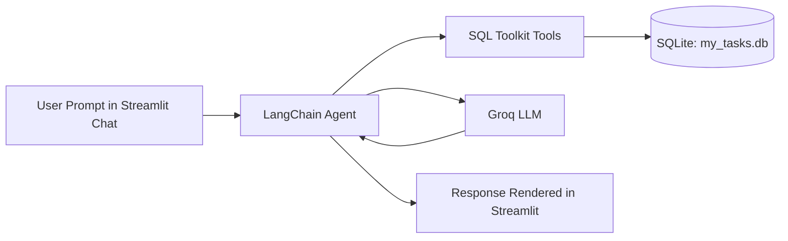

# TaskBot: SQL-Powered AI Task Manager

A lightweight AI assistant that manages your todo tasks using natural language and a SQLite database.

Built with LangChain, LangGraph memory checkpointing, Groq-hosted LLMs, and a Streamlit chat interface.

---

## Why This Project

TaskBot lets you interact with your task database conversationally, for example:

- "Add a task to finish the project report by Friday"
- "Mark task 3 as completed"
- "Show my pending tasks"

Instead of writing SQL manually, you describe what you want and the agent translates it into database operations.

---

## Features

- Natural-language CRUD on a local SQLite tasks database
- Auto-creates `tasks` table on first run
- Streamlit chat UI for simple browser-based interaction
- SQL toolkit-backed agent (LangChain SQL tools)
- In-memory conversation checkpointing with LangGraph
- Guardrail prompt rules for cleaner query behavior

---

## Tech Stack

- Python
- Streamlit
- LangChain
- LangGraph
- LangChain Community SQL Toolkit
- Groq via `langchain_groq`
- SQLite

---

## Project Structure

```text
GenAI_Agents/
|-- SQL_agent.py         # Main Streamlit app + AI SQL agent logic
|-- requirements.txt     # Python dependencies
|-- README.md            # Project documentation
```

---

## How It Works



Execution flow:

1. The app loads environment variables.
2. It initializes SQLite and ensures the `tasks` table exists.
3. A Groq-backed chat model is connected to SQL tools.
4. User messages are sent to the agent.
5. The agent runs SQL operations and returns a chat response.

---

## Database Schema

The app creates this table if it does not already exist:

- `id` (INTEGER, primary key, autoincrement)
- `title` (TEXT, required)
- `description` (TEXT, optional)
- `status` (TEXT: `pending`, `in_progress`, `completed`)
- `created_at` (TIMESTAMP, default current time)

Database file:

- `my_tasks.db` (created in the project root at runtime)

---

## Setup

### 1. Clone and enter the project

```powershell
git clone <your-repo-url>
cd TaskBot
```

### 2. Create and activate a virtual environment

```powershell
python -m venv .venv
.\.venv\Scripts\Activate.ps1
```

### 3. Install dependencies

```powershell
pip install -r requirements.txt
```

### 4. Configure environment variables

Create a `.env` file in the project root:

```env
GROQ_API_KEY=your_groq_api_key_here
```

### 5. Run the app

```powershell
streamlit run SQL_agent.py
```

Open the local URL shown by Streamlit (usually `http://localhost:8501`).

---

## Example Prompts

- "Add a task: Prepare quarterly budget presentation"
- "Create a task to practice SQL joins"
- "Show my latest tasks"
- "Update task 2 status to in_progress"
- "Delete the task titled practice SQL joins"
- "List completed tasks"

---

## Notes and Limitations

- Conversation memory is in-process (`InMemorySaver`) and resets when the app restarts.
- The model is set to `openai/gpt-oss-20b` through Groq in the current code.
- The database is local SQLite, suitable for learning and prototyping.


